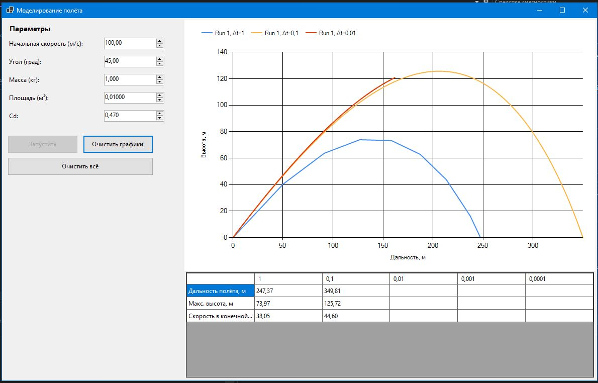
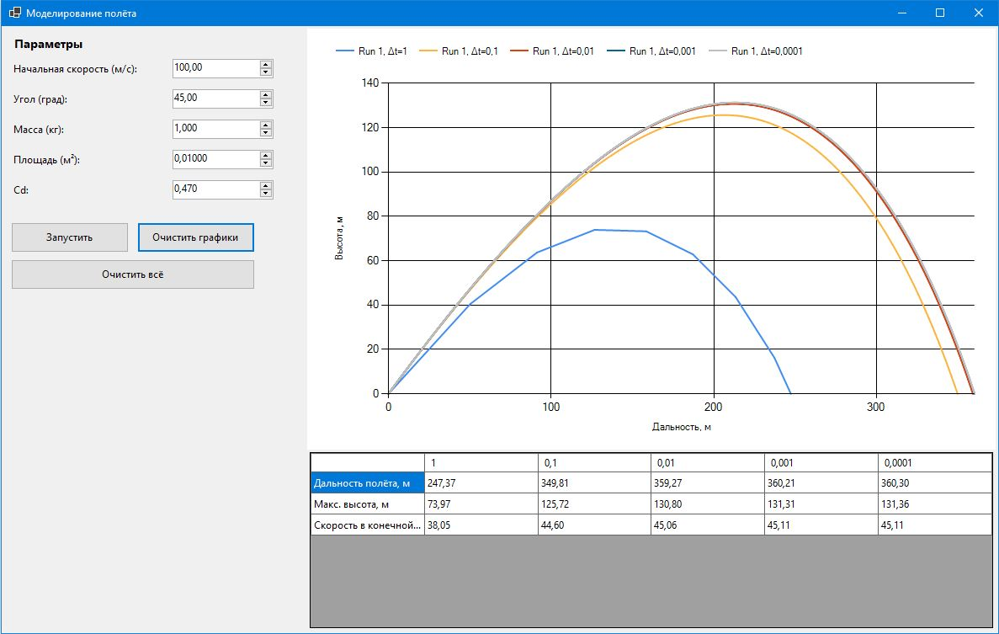
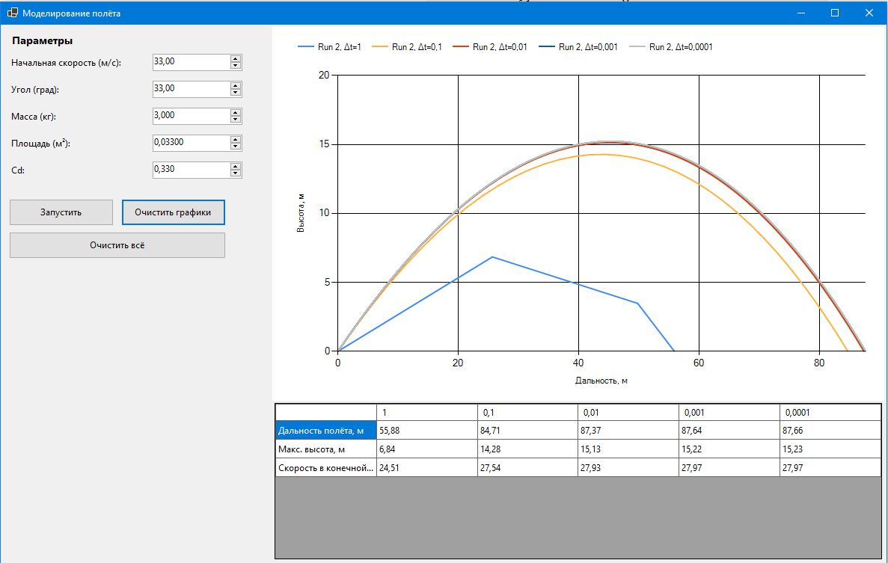

# Моделирование полёта тела в атмосфере

## Описание
Данное приложение моделирует движение тела в атмосфере с учётом сопротивления воздуха. Реализована возможность задания начальной скорости и угла запуска, а также моделирования с разными шагами по времени. Результаты отображаются в виде траекторий на графике и таблицы с ключевыми характеристиками полёта.

---

## Используемые физические формулы
- Сопротивление воздуха рассчитывается по формуле:
  
  \[
  F_d = \frac{1}{2} \rho C_d A v^2
  \]
  
  где:  
  \( \rho \) — плотность воздуха,  
  \( C_d \) — коэффициент сопротивления,  
  \( A \) — площадь поперечного сечения тела,  
  \( v \) — скорость тела.  

- Движение рассчитывается методом **явного интегрирования (Euler)** с выбранным шагом по времени \(\Delta t\).

## Примеры работы программы




## Исходный код программы
```csharp
using System;
using System.Collections.Generic;
using System.Drawing;
using System.Windows.Forms;
using System.Windows.Forms.DataVisualization.Charting;

public class MainForm : Form
{
    private Chart chart;
    private DataGridView dgv;
    private Button btnRun;
    private Button btnClearAll;
    private Button btnClearGraphs;
    private NumericUpDown nudSpeed;
    private NumericUpDown nudAngle;
    private NumericUpDown nudMass;
    private NumericUpDown nudArea;
    private NumericUpDown nudCd;

    private double rho = 1.225;
    private System.Windows.Forms.Timer animTimer;
    private readonly double[] dts = new double[] { 1.0, 0.1, 0.01, 0.001, 0.0001 };

    private SimulationInstance currentSim = null;
    private int currentDtIndex = 0;
    private int runCounter = 0;
    private Dictionary<double, int> dtToColumn = new Dictionary<double, int>();

    public MainForm()
    {
        Text = "Моделирование полёта";
        Size = new Size(1200, 760);
        StartPosition = FormStartPosition.CenterScreen;

        var mainLayout = new TableLayoutPanel { Dock = DockStyle.Fill, ColumnCount = 2 };
        mainLayout.ColumnStyles.Add(new ColumnStyle(SizeType.Absolute, 360));
        mainLayout.ColumnStyles.Add(new ColumnStyle(SizeType.Percent, 100));
        Controls.Add(mainLayout);

        var leftPanel = new Panel { Dock = DockStyle.Fill, Padding = new Padding(10) };
        mainLayout.Controls.Add(leftPanel, 0, 0);

        int y = 8;
        leftPanel.Controls.Add(new Label { Text = "Параметры", Font = new Font("Segoe UI", 10, FontStyle.Bold), Location = new Point(8, y), AutoSize = true });
        y += 32;

        leftPanel.Controls.Add(new Label { Text = "Начальная скорость (м/с):", Location = new Point(8, y), AutoSize = true });
        nudSpeed = new NumericUpDown { Location = new Point(200, y - 4), Minimum = 0, Maximum = 10000, DecimalPlaces = 2, Value = 100.00M, Width = 120 };
        leftPanel.Controls.Add(nudSpeed);
        y += 36;

        leftPanel.Controls.Add(new Label { Text = "Угол (град):", Location = new Point(8, y), AutoSize = true });
        nudAngle = new NumericUpDown { Location = new Point(200, y - 4), Minimum = 0, Maximum = 90, DecimalPlaces = 2, Value = 45.00M, Width = 120 };
        leftPanel.Controls.Add(nudAngle);
        y += 36;

        leftPanel.Controls.Add(new Label { Text = "Масса (кг):", Location = new Point(8, y), AutoSize = true });
        nudMass = new NumericUpDown { Location = new Point(200, y - 4), Minimum = 0.001M, Maximum = 10000, DecimalPlaces = 3, Value = 1.0M, Width = 120 };
        leftPanel.Controls.Add(nudMass);
        y += 36;

        leftPanel.Controls.Add(new Label { Text = "Площадь (м?):", Location = new Point(8, y), AutoSize = true });
        nudArea = new NumericUpDown { Location = new Point(200, y - 4), Minimum = 0.00001M, Maximum = 1000, DecimalPlaces = 5, Value = 0.01M, Width = 120 };
        leftPanel.Controls.Add(nudArea);
        y += 36;

        leftPanel.Controls.Add(new Label { Text = "Cd:", Location = new Point(8, y), AutoSize = true });
        nudCd = new NumericUpDown { Location = new Point(200, y - 4), Minimum = 0.01M, Maximum = 5M, DecimalPlaces = 3, Value = 0.47M, Width = 120 };
        leftPanel.Controls.Add(nudCd);
        y += 46;

        btnRun = new Button { Text = "Запустить", Location = new Point(8, y), Width = 140, Height = 36 };
        btnRun.Click += BtnRun_Click;
        leftPanel.Controls.Add(btnRun);

        btnClearGraphs = new Button { Text = "Очистить графики", Location = new Point(158, y), Width = 140, Height = 36 };
        btnClearGraphs.Click += BtnClearGraphs_Click;
        leftPanel.Controls.Add(btnClearGraphs);
        y += 44;

        btnClearAll = new Button { Text = "Очистить всё", Location = new Point(8, y), Width = 290, Height = 36 };
        btnClearAll.Click += BtnClearAll_Click;
        leftPanel.Controls.Add(btnClearAll);

        var rightLayout = new TableLayoutPanel { Dock = DockStyle.Fill, RowCount = 2 };
        rightLayout.RowStyles.Add(new RowStyle(SizeType.Percent, 70));
        rightLayout.RowStyles.Add(new RowStyle(SizeType.Percent, 30));
        mainLayout.Controls.Add(rightLayout, 1, 0);

        chart = new Chart { Dock = DockStyle.Fill, BackColor = Color.White, Margin = new Padding(0) };
        var ca = new ChartArea("Default");
        ca.AxisX.Title = "Дальность, м";
        ca.AxisY.Title = "Высота, м";
        ca.AxisX.LabelStyle.Format = "F0";
        ca.AxisY.LabelStyle.Format = "F0";
        ca.AxisY.IsStartedFromZero = true;
        ca.AxisY.Minimum = 0;
        ca.AxisX.IsMarginVisible = false;
        chart.ChartAreas.Add(ca);
        chart.Legends.Add(new Legend { Docking = Docking.Top });
        rightLayout.Controls.Add(chart, 0, 0);

        dgv = new DataGridView { Dock = DockStyle.Fill, ReadOnly = true, AllowUserToAddRows = false, RowHeadersVisible = false, AutoSizeColumnsMode = DataGridViewAutoSizeColumnsMode.Fill };
        rightLayout.Controls.Add(dgv, 0, 1);

        SetupResultTable();

        animTimer = new System.Windows.Forms.Timer();
        animTimer.Interval = 12;
        animTimer.Tick += AnimTimer_Tick;
    }

    private void SetupResultTable()
    {
        dgv.Columns.Clear();
        dgv.Rows.Clear();
        dtToColumn.Clear();

        dgv.Columns.Add("param", "");
        dgv.Columns[0].ReadOnly = true;
        dgv.Columns[0].Width = 180;

        for (int i = 0; i < dts.Length; i++)
        {
            string hdr = dts[i].ToString("G");
            dgv.Columns.Add($"dt{hdr}", hdr);
            dtToColumn[dts[i]] = dgv.Columns.Count - 1;
        }

        dgv.Rows.Add("Дальность полёта, м");
        dgv.Rows.Add("Макс. высота, м");
        dgv.Rows.Add("Скорость в конечной точке, м/с");
    }

    private void BtnClearGraphs_Click(object sender, EventArgs e)
    {
        chart.Series.Clear();
        chart.ChartAreas[0].RecalculateAxesScale();
        chart.ChartAreas[0].AxisY.Minimum = 0;
    }

    private void BtnClearAll_Click(object sender, EventArgs e)
    {
        chart.Series.Clear();
        SetupResultTable();
        chart.ChartAreas[0].RecalculateAxesScale();
        chart.ChartAreas[0].AxisY.Minimum = 0;
    }

    private void BtnRun_Click(object sender, EventArgs e)
    {
        if (animTimer.Enabled || currentSim != null) return;

        for (int r = 0; r < dgv.Rows.Count; r++)
            for (int c = 1; c < dgv.Columns.Count; c++) dgv.Rows[r].Cells[c].Value = "";

        runCounter++;
        currentDtIndex = 0;
        StartNextSimulation();
        btnRun.Enabled = false;
    }

    private void StartNextSimulation()
    {
        if (currentDtIndex >= dts.Length)
        {
            currentSim = null;
            animTimer.Stop();
            btnRun.Enabled = true;
            chart.ChartAreas[0].RecalculateAxesScale();
            chart.ChartAreas[0].AxisY.Minimum = 0;
            return;
        }

        double dt = dts[currentDtIndex];
        var ser = new Series($"run{runCounter}_dt{dt}") { ChartType = SeriesChartType.Line, BorderWidth = 2, LegendText = $"Run {runCounter}, ?t={dt:G}" };
        chart.Series.Add(ser);

        double v0 = (double)nudSpeed.Value;
        double angleRad = (double)nudAngle.Value * Math.PI / 180.0;
        double vx0 = v0 * Math.Cos(angleRad);
        double vy0 = v0 * Math.Sin(angleRad);
        double mass = (double)nudMass.Value;
        double area = (double)nudArea.Value;
        double Cd = (double)nudCd.Value;

        // fastMode for dt == 0.001 and dt == 0.0001
        bool fastMode = (Math.Abs(dt - 0.001) < 1e-15) || (Math.Abs(dt - 0.0001) < 1e-15);

        currentSim = new SimulationInstance()
        {
            Dt = dt,
            Vx = vx0,
            Vy = vy0,
            X = 0.0,
            Y = 0.0,
            T = 0.0,
            MaxH = 0.0,
            Series = ser,
            Mass = mass,
            Area = area,
            Cd = Cd,
            Rho = rho,
            RunId = runCounter,
            DtIndex = currentDtIndex,
            FastMode = fastMode,
            TickCounter = 0,
            PointsAddedCounter = 0
        };

        currentSim.Series.Points.AddXY(FixZero(0.0), FixZero(0.0));
        currentSim.PointsAddedCounter++;

        if (fastMode)
        {
            DoFastSimulationAndRender(currentSim);
            currentSim = null;
            currentDtIndex++;
            StartNextSimulation();
        }
        else
        {
            animTimer.Start();
        }
    }

    // Drag formula used here:
    // F_d = 0.5 * rho * C_d * A * v^2
    // a_drag = F_d / m, projected along velocity direction.
    private void DoFastSimulationAndRender(SimulationInstance sim)
    {
        double dt = sim.Dt;
        double vx = sim.Vx, vy = sim.Vy, x = sim.X, y = sim.Y;
        double mass = sim.Mass, area = sim.Area, Cd = sim.Cd, rhoL = sim.Rho;
        double g = 9.81;

        var pts = new List<PointD>();
        pts.Add(new PointD(x, y));

        int steps = 0;
        // sampling heuristic: roughly one sample per 0.001s
        int sampleInterval = Math.Max(1, (int)Math.Round(0.001 / dt));
        int maxAllowedPoints = 3000;

        while (true)
        {
            steps++;

            double v = Math.Sqrt(vx * vx + vy * vy);
            double dragMag = (v > 1e-15) ? 0.5 * rhoL * Cd * area * v * v : 0.0;
            double ax = 0.0;
            double ay = -g;
            if (v > 1e-15)
            {
                ax += -dragMag / mass * (vx / v);
                ay += -dragMag / mass * (vy / v);
            }

            double lastx = x, lasty = y, lastvx = vx, lastvy = vy, lastt = sim.T;
            vx += ax * dt;
            vy += ay * dt;
            x += vx * dt;
            y += vy * dt;
            sim.T += dt;

            if (y > sim.MaxH) sim.MaxH = y;

            if (steps % sampleInterval == 0) pts.Add(new PointD(x, y));

            if (pts.Count > maxAllowedPoints)
            {
                sampleInterval *= 2;
                var reduced = new List<PointD>();
                for (int i = 0; i < pts.Count; i += 2) reduced.Add(pts[i]);
                pts = reduced;
            }

            if (y < 0.0)
            {
                double dy = y - lasty;
                double dx = x - lastx;
                double frac = (Math.Abs(dy) > 1e-15) ? Math.Max(0.0, Math.Min(1.0, -lasty / dy)) : 0.0;
                double landX = lastx + frac * dx;
                double landVx = lastvx + frac * (vx - lastvx);
                double landVy = lastvy + frac * (vy - lastvy);
                double finalSpeed = Math.Sqrt(landVx * landVx + landVy * landVy);

                if (pts.Count == 0 || Math.Abs(pts[pts.Count - 1].Y) > 1e-9) pts.Add(new PointD(landX, 0.0));
                else pts[pts.Count - 1] = new PointD(landX, 0.0);

                foreach (var p in pts)
                {
                    double px = FixZero(p.X);
                    double py = (p.Y < 0.0) ? 0.0 : FixZero(p.Y);
                    sim.Series.Points.AddXY(px, py);
                }

                if (dtToColumn.TryGetValue(sim.Dt, out int colIdx))
                {
                    dgv.Rows[0].Cells[colIdx].Value = FixZero(pts[pts.Count - 1].X).ToString("F2");
                    dgv.Rows[1].Cells[colIdx].Value = FixZero(sim.MaxH).ToString("F2");
                    dgv.Rows[2].Cells[colIdx].Value = FixZero(finalSpeed).ToString("F2");
                }

                chart.ChartAreas[0].RecalculateAxesScale();
                chart.ChartAreas[0].AxisY.Minimum = 0;
                return;
            }

            if (sim.T > 20000 || Math.Abs(x) > 1e9) break;
        }

        var lastPoint = pts.Count > 0 ? pts[pts.Count - 1] : new PointD(x, Math.Max(0, y));
        foreach (var p in pts) sim.Series.Points.AddXY(FixZero(p.X), (p.Y < 0.0) ? 0.0 : FixZero(p.Y));
        if (dtToColumn.TryGetValue(sim.Dt, out int cIdx))
        {
            dgv.Rows[0].Cells[cIdx].Value = FixZero(lastPoint.X).ToString("F2");
            dgv.Rows[1].Cells[cIdx].Value = FixZero(sim.MaxH).ToString("F2");
            dgv.Rows[2].Cells[cIdx].Value = FixZero(Math.Sqrt(vx * vx + vy * vy)).ToString("F2");
        }
        chart.ChartAreas[0].RecalculateAxesScale();
        chart.ChartAreas[0].AxisY.Minimum = 0;
    }

    private void AnimTimer_Tick(object sender, EventArgs e)
    {
        if (currentSim == null) { animTimer.Stop(); return; }

        var sim = currentSim;
        double dt = sim.Dt;
        double g = 9.81;

        double v = Math.Sqrt(sim.Vx * sim.Vx + sim.Vy * sim.Vy);
        double dragMag = (v > 1e-15) ? 0.5 * sim.Rho * sim.Cd * sim.Area * v * v : 0.0;
        double ax = 0.0;
        double ay = -g;
        if (v > 1e-15) { ax += -dragMag / sim.Mass * (sim.Vx / v); ay += -dragMag / sim.Mass * (sim.Vy / v); }

        double lastX = sim.X, lastY = sim.Y, lastVx = sim.Vx, lastVy = sim.Vy, lastT = sim.T;

        sim.Vx += ax * dt;
        sim.Vy += ay * dt;
        sim.X += sim.Vx * dt;
        sim.Y += sim.Vy * dt;
        sim.T += dt;
        sim.TickCounter++;

        int drawEvery = Math.Max(1, (int)(0.001 / dt));
        if (drawEvery < 1) drawEvery = 1;

        if (sim.TickCounter % drawEvery == 0)
        {
            double px = FixZero(sim.X);
            double py = (sim.Y < 0.0) ? 0.0 : FixZero(sim.Y);
            sim.Series.Points.AddXY(px, py);
            sim.PointsAddedCounter++;
        }

        if (sim.Y > sim.MaxH) sim.MaxH = sim.Y;

        int axisUpdateInterval = 25;
        if (sim.PointsAddedCounter % axisUpdateInterval == 0) { chart.ChartAreas[0].RecalculateAxesScale(); chart.ChartAreas[0].AxisY.Minimum = 0; }

        if (sim.Y < 0.0)
        {
            double dy = sim.Y - lastY;
            double dx = sim.X - lastX;
            double frac = (Math.Abs(dy) > 1e-15) ? Math.Max(0.0, Math.Min(1.0, -lastY / dy)) : 0.0;
            double landX = lastX + frac * dx;
            double landVx = lastVx + frac * (sim.Vx - lastVx);
            double landVy = lastVy + frac * (sim.Vy - lastVy);
            double finalSpeed = Math.Sqrt(landVx * landVx + landVy * landVy);

            var pts = sim.Series.Points;
            if (pts.Count > 0)
            {
                pts[pts.Count - 1].XValue = FixZero(landX);
                pts[pts.Count - 1].YValues[0] = 0.0;
            }
            else sim.Series.Points.AddXY(FixZero(landX), 0.0);

            if (dtToColumn.TryGetValue(sim.Dt, out int colIdx))
            {
                dgv.Rows[0].Cells[colIdx].Value = FixZero(landX).ToString("F2");
                dgv.Rows[1].Cells[colIdx].Value = FixZero(sim.MaxH).ToString("F2");
                dgv.Rows[2].Cells[colIdx].Value = FixZero(finalSpeed).ToString("F2");
            }

            chart.ChartAreas[0].RecalculateAxesScale();
            chart.ChartAreas[0].AxisY.Minimum = 0;
            animTimer.Stop();
            currentSim = null;
            currentDtIndex++;
            StartNextSimulation();
            return;
        }

        if (sim.T > 20000 || Math.Abs(sim.X) > 1e9)
        {
            double finalSpeed = Math.Sqrt(sim.Vx * sim.Vx + sim.Vy * sim.Vy);
            if (dtToColumn.TryGetValue(sim.Dt, out int colIdx))
            {
                dgv.Rows[0].Cells[colIdx].Value = FixZero(sim.X).ToString("F2");
                dgv.Rows[1].Cells[colIdx].Value = FixZero(sim.MaxH).ToString("F2");
                dgv.Rows[2].Cells[colIdx].Value = FixZero(finalSpeed).ToString("F2");
            }
            animTimer.Stop();
            currentSim = null;
            currentDtIndex++;
            StartNextSimulation();
            return;
        }
    }

    private double FixZero(double v) => (Math.Abs(v) < 1e-9) ? 0.0 : v;

    private class SimulationInstance
    {
        public double Dt;
        public double Vx, Vy;
        public double X, Y, T, MaxH;
        public Series Series;
        public double Mass, Area, Cd, Rho;
        public int RunId, DtIndex;
        public bool FastMode;
        public int TickCounter, PointsAddedCounter;
    }

    private struct PointD { public double X, Y; public PointD(double x, double y) { X = x; Y = y; } }
}

## Выводы

1. **Шаг моделирования влияет на точность:** при больших `dt` (например, 1/с) траектория грубая и дальность полёта меньше точного значения; при маленьких `dt` (0.001–0.0001/с) расчёты точнее, траектория плавнее.  
2. **Сопротивление воздуха заметно уменьшает дальность:** без воздуха тело летело бы дальше и выше.  
3. **Максимальная высота зависит от угла запуска:** чем ближе угол к 45°, тем выше траектория, но сопротивление слегка искажает идеальную форму.  
4. **Сравнение разных шагов dt:** таблица и график позволяют визуально увидеть расхождение результатов и оценить влияние шага на точность и стабильность расчёта.
