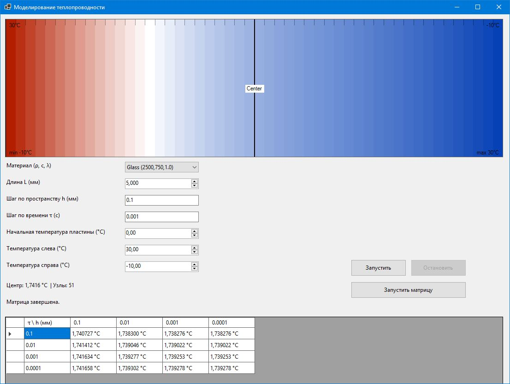
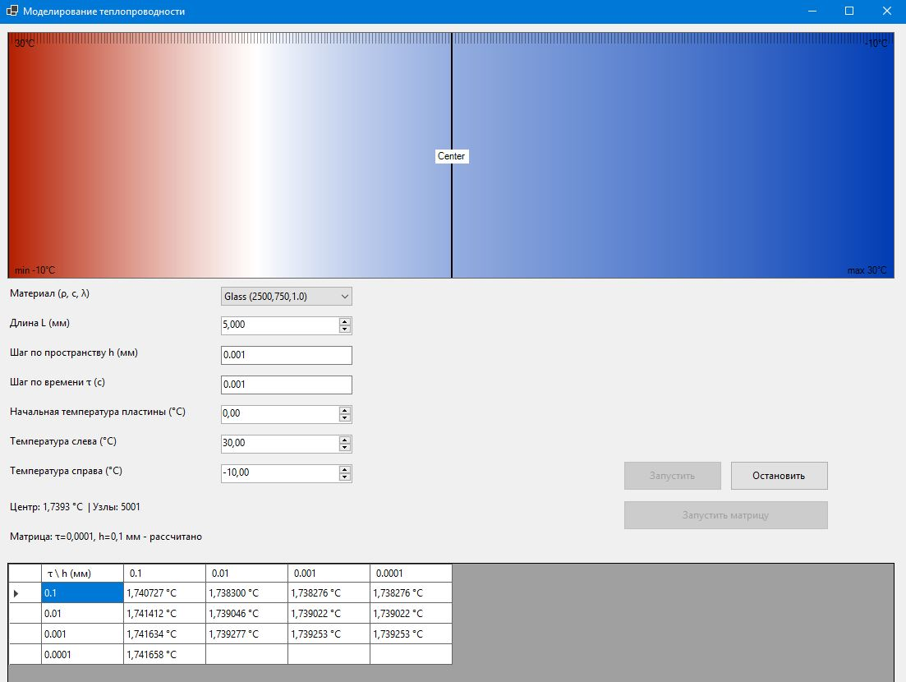
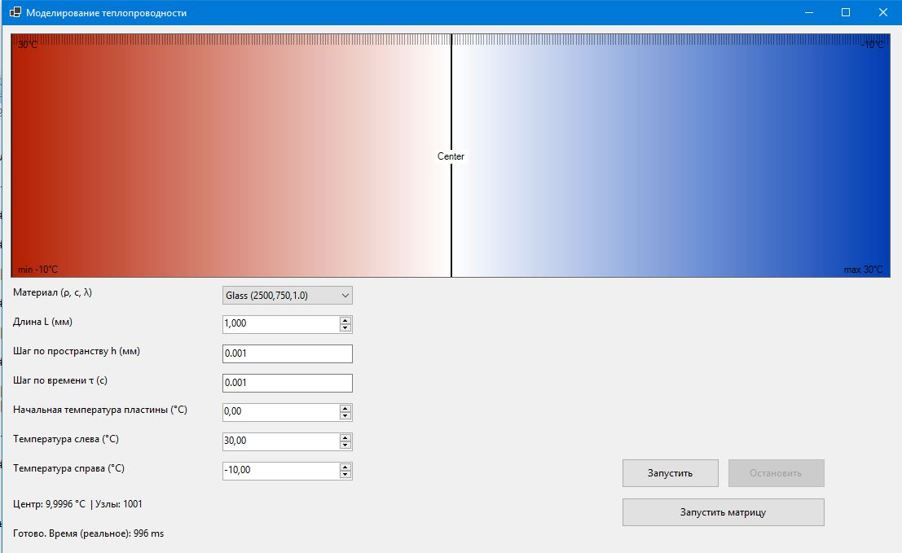
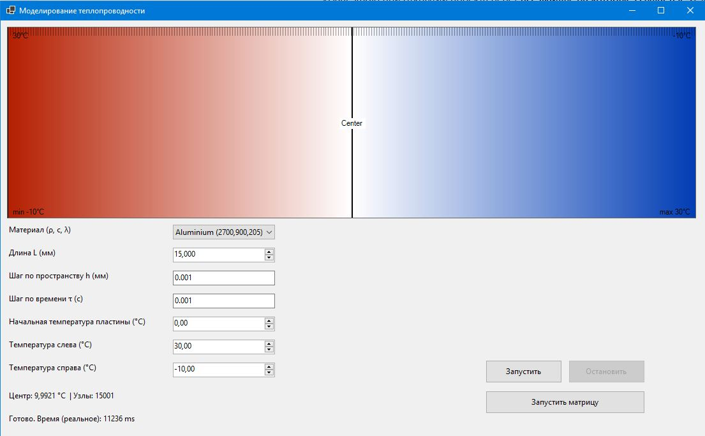
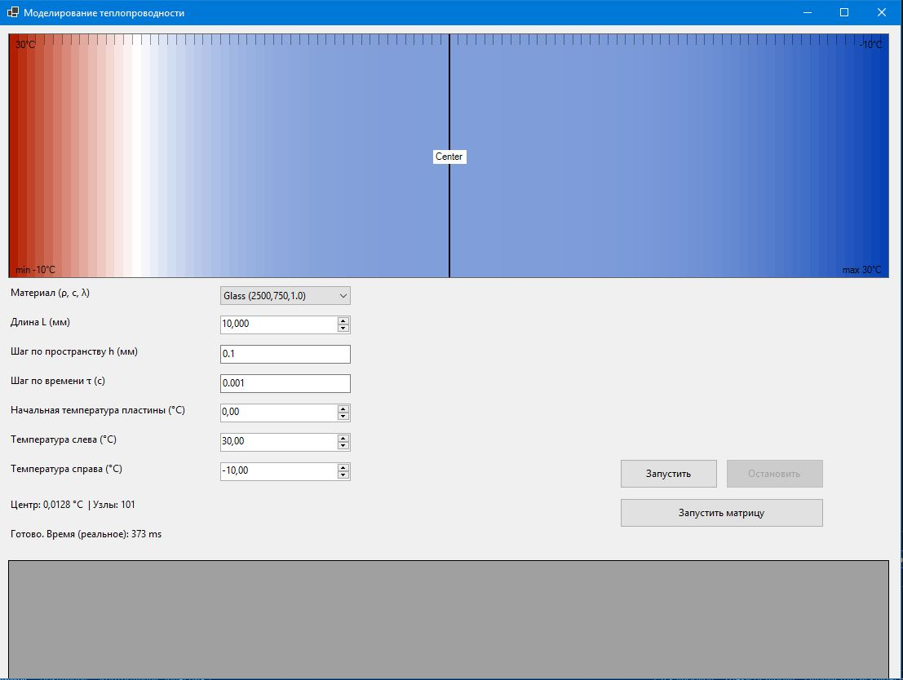

# Лабораторная работа 2

## Моделирование теплопроводности в одномерной стенке

### Описание работы

В данной лабораторной работе реализована программа для численного решения одномерного уравнения теплопроводности методом конечных разностей.

Модель описывает распределение температуры в плоской стенке при заданных граничных условиях.
Решение выполняется неявной схемой с использованием метода прогонки (алгоритма Томаса).

Программа позволяет:

* задавать толщину стенки
* задавать шаг по пространству
* задавать шаг по времени
* задавать температуры на границах
* наблюдать распределение температуры
* анализировать влияние шага сетки на результат

---

### Математическая модель

Используется одномерное уравнение теплопроводности:

```
∂T/∂t = a * ∂²T/∂x²
```

где:

* T — температура
* t — время
* x — координата
* a — коэффициент температуропроводности

Для решения применяется метод конечных разностей с неявной схемой.

---

### Скриншоты

#### Начальное распределение температуры



#### Процесс формирования таблицы и меньшие шаги на графике



#### Другие данные





---

### Анализ результатов

В ходе моделирования было исследовано влияние шага по пространству и времени на точность решения.

Было установлено, что:

* при уменьшении шага по пространству точность возрастает
* при уменьшении шага по времени решение становится стабильнее
* слишком маленькие шаги значительно увеличивают время расчёта
* после определённого значения уменьшение шага почти не влияет на результат

Например:

* при толщине 1 мм температура быстро выравнивается
* при толщине 10 мм изменение температуры происходит значительно медленнее

Это соответствует физическому смыслу процесса теплопроводности.

---

### Вывод

Метод конечных разностей позволяет эффективно решать задачу теплопроводности.

Для практических расчётов достаточно использовать разумные шаги по времени и пространству.
Слишком маленькие шаги увеличивают время вычислений, но дают лишь незначительное повышение точности.

Таким образом, важно выбирать шаги сетки как компромисс между точностью и скоростью вычислений.
